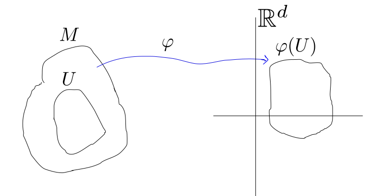

.. role:: underline
    :class: underline

Repaso de Variedades diferenciables
=====================================

Variedades diferenciables
~~~~~~~~~~~~~~~~~~~~~~~~~~~~~~~~~~~~~

Sea :math:`M` un espacio topológico, Hausdorff, :math:`N_{2}`, localmente euclideo de dimensión :math:`d`, :math:`\forall p \in M,\exists U \text{ abierto de } \mathbb{R}^{d}` y un homeomorfismo :math:`\psi:U \to M, p \in \psi(U)` 

.. image:: img/variedades_diferenciables.svg
   :height: 300px
   :width: 100%
   :scale: 100%
   :alt: variedades diferenciables
   :align: center

Si :math:`\varphi:U \subset M\to\mathbb{R}^{d}, p \in \varphi(U)` es un homeomorfismo (:math:`U` abierto en :math:`M`) entonces :math:`(U,M)` se llama :underline:`sistema de coordenadas`.

Variedad Diferenciable
~~~~~~~~~~~~~~~~~~~~~~~~~

**Definición**: Una estructura diferenciable :math:`\mathcal{F}` en :math:`M` es una colección de sistemas de coordenadas :math:`\{(U_{\alpha},M_{\alpha})|\alpha\in A\}` tal que

    1. :math:`M = \displaystyle\bigcup_{\alpha \in A} U_{\alpha}`
    2. Si :math:`(U,\varphi_{1})` y :math:`(U,\varphi_{2})` son dos sistemas de coordenadas en :math:`\mathcal{F}`. Entonces :math:`\varphi_{2}\circ\varphi_{1}^{-1}:\varphi_{1}(U\cap V)\to\varphi_{2}(U\cap V) \subseteq \mathbb{R}^{d}` es :math:`C^{\infty}` y tiene inversa :math:`C^{\infty}`.
    3. La colección :math:`\mathcal{F}` es *maximal* con respecto a **2**.

:math:`(M,\mathcal{F})` es una :underline:`variedad diferenciable`.

Funciones Diferenciables
~~~~~~~~~~~~~~~~~~~~~~~~~
    - Sea :math:`U \subset M`, :math:`U` abierto. Decimos Si :math:`f:U \to\mathbb{R}` es :math:`C^{\infty}` sobre :math:`U` si :math:`f\circ\varphi^{-1}:\varphi(U\cap V) \subseteq \mathbb{R}^{d}\to\mathbb{R}` es :math:`C^{\infty}`, :math:`\forall (U,\varphi)` sistema de coordenadas.
    .. image:: img/funciones_diferenciables_item_uno.svg
        :height: 200px
        :width: 100%
        :alt: funciones diferenciables item uno
        :align: center

    - Si :math:`F: M \to N` es continua entre dos variedades :math:`M \text{ y } N`
    .. image:: img/funciones_diferenciables_item_dos.svg
        :height: 200px
        :width: 100%
        :alt: funciones diferenciables item uno
        :align: center
    
    Entonces :math:`F` es :math:`C^{\infty}` si :math:`\psi \circ F \circ \varphi^{-1}` es :math:`C^{\infty}` donde :math:`(U,\varphi)` es un ssistema de coordenadas en :math:`M` y :math:`(V,\psi)` es un sistema de coordenadas en :math:`N`.

    - Si :math:`F: M \to N` es :math:`C^{\infty}`, es :math:`1-1` y *suryectiva* decimos que f es un :underline:`difeomorfismo` con inversos en :math:`C^{\infty}`.

Vectores (ver Warner)
~~~~~~~~~~~~~~~~~~~~~~~~~

Sea :math:`M` una variedad y :math:`m \in M`. Sea :math:`C^{\infty}_{m}` el conjunto de funciones :math:`f:M \to\mathbb{R}` de clase :math:`C^{\infty}` en el punto :math:`m\in M` :math:`\leftarrow` *es un álgebra*.

Un vector :math:`v` en el punto :math:`m \in M` es una :underline:`derivación lineal` de :math:`C^{\infty}_{m}`:

.. math::
    v: C^{\infty}_{m} \to \mathbb{R}

*a*). :math:`v(f+\lambda g)=v(f)+\lambda v(g)`

*b*). :math:`v(f\cdot g)=v(f)g(m)+f(m)v(g)`

:math:`M_{m}` denota el conjunto de todos los vectores tangentes a :math:`m`.

:underline:`Definición`: :math:`M_{m}` es el espacio tangente a :math:`M` en :math:`m`.

:underline:`Ejercicio`: Verificar que :math:`M_{m}` es un :math:`\mathbb{R}`-espacio vectorial.

Diferencial
~~~~~~~~~~~~~~~~~~~~~~~~

Sea :math:`F:M \to N` de clase :math:`C^{\infty}` y sea :math:`m \in M`. El *diferencial* de :math:`F` es una aplicación lineal que va desde el espacio tangente a :math:`M` en :math:`m` al espacio tangente a :math:`N` en :math:`F(m)`, es decir, 

.. math::
    
    dF:M_{m} \to N_{F(m)}

**Definición**:

.. math::
    
    (dF)(v)f=v(f \circ F),~\forall f \in C^{\infty}_{F(m)}

.. note:: Vamos a explicar la Definición.

    Queremos evaluar a :math:`dF` en algo que esté en :math:`M_{m}` (el espacio tangente a :math:`M` en :math:`m`), que está formado por vectores :math:`v`. Ahora queremos que :math:`(dF)(v)` sea un vector sobre :math:`N`, entonces como va a ser un vector en :math:`N_{F(m)}` (el espacio tangente a :math:`N` en :math:`F(m)`), tiene que ser algo que actúe en funciones que sean de clase :math:`C^{\infty}` al rededor de :math:`N_{F(m)}`. Por lo tanto, voy a evaluar :math:`(dF)(v)` en una :math:`f: N \to \mathbb{R}`, es decir,
    
    .. math::

        \begin{equation}
            (dF)(v)f
        \end{equation}

    Esto va a ser igual a evaluar el vector :math:`v` en funciones sobre :math:`M`, entonces lo hacemos sobre :math:`f\circ F:M \to \mathbb{R}`, :math:`\forall f \in C^{\infty}_{F(m)}`. Luego,

    .. math::
        
        (dF)(v)f=v(f \circ F),~\forall f \in C^{\infty}_{F(m)}

    está definida.

En coordenadas
~~~~~~~~~~~~~~~~

Sea :math:`(U,\varphi)` un sistema de coordenadas con funciones coordenadas :math:`x_{1}, x_{2}, x_{3}, \dots, x_{d}`, en la variedad :math:`M` y :math:`m\in M`

.. math::
    \begin{align}
        \varphi(m)\in \mathbb{R}\Longrightarrow & \varphi(m) = (x_{1}(m), x_{2}(m), x_{3}(m), \dots, x_{d}(m))\\
                                                & x_{i}=r_{i}\circ \varphi: U \to \mathbb{R}
    \end{align}

:math:`\displaystyle\left( \frac{\partial}{\partial x_{i}} |_{m} \right) f = \frac{\partial (f\circ \varphi^{-1})}{\partial r_{i}}` es un *vector*.

    :height: 200px
    :width: 100%
    :alt: funciones diferenciables item uno
    :align: center
    
    funciones diferenciables

.. math::
    \begin{align}
        \displaystyle v\in M_{m}\Longrightarrow v=\sum_{i=1}^{d} a_{i}\left( \frac{\partial}{\partial x_{i}} \right)_{m} \text{ para algún } a_{i} 
    \end{align}

.. important::
    - Probar que las esferas :math:`S^{d}` son variedades.
    - Ver los Ejemplos de la página 7 del libro de Warner. En particular, el **Ejemplo g** de Variedad Producto.